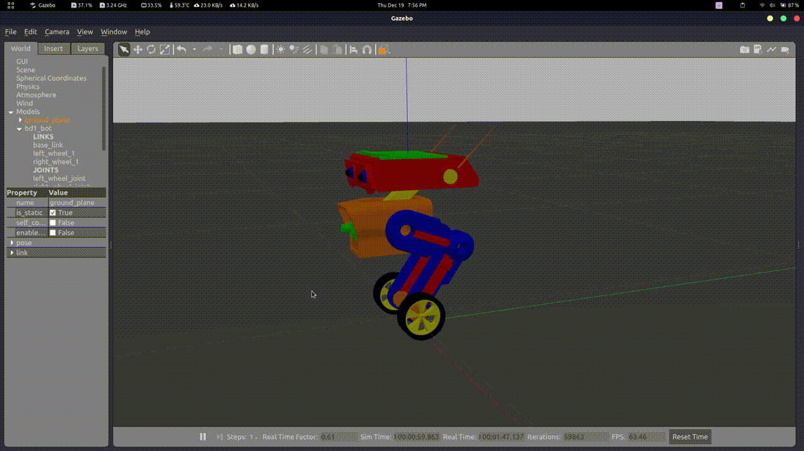

# ROS2 Self Balancing Robot

In this project, a self-balancing robot called BD1 is designed and simulated to learn ROS2 and Control Systems.

The BD1 bot was originally designed in the Star Wars Jedi The Fallen Order video game. In this project, we have re-designed the BD1 bot for self-balancing tasks. This project is open source to robotics enthusiasts for their projects.

## Pre-requisite

- [ROS2 Humble 🔗](https://docs.ros.org/en/humble/Installation/Ubuntu-Install-Debians.html) with Gazebo

    While installing ROS2 make sure you use this command.

    ```
    sudo apt install ros-humble-desktop-full # Instead sudo apt install ros-humble-desktop
    ```

    Check whether Gazebo-11 is installed using the following command.
    ```
    gazebo --version
    ```

If the gazebo is not recognized, install gazebo-11 using this [link](https://classic.gazebosim.org/tutorials?tut=ros2_installing&cat=connect_ros). Make sure to use the appropriate distro in the command.

- ROS2 binary packages

    ```
    sudo apt-get install ros-humble-rosidl-typesupport-c
    sudo apt-get install ros-humble-joint-state-publisher
    sudo apt-get install ros2-controllers -y
    sudo apt-get install ros-humble-turtle-tf2-py ros-humble-tf2-tools ros-humble-tf-transformations
    sudo pip3 install transforms3d
    ```

## Sourcing

source ROS2 and Gazebo `setup.bash` in the `~/.bashrc` file.

    # For Colcon Auto-Completion
    source /usr/share/colcon_argcomplete/hook/colcon-argcomplete.bash
    # ROS 2 Bash
    source /opt/ros/humble/setup.bash
    # Gazebo 11 Bash
    source /usr/share/gazebo-11/setup.sh
    # ROS2 Workspace
    source ~/<ROS2-Workspace>/install/setup.bash

## Repository Structure

- **assets** - images, bot properties are added.
- **bd1_bot_description** – ROS2 python package containing all the files related to bd1_bot for simulation
- **bd1_self_balancer** – ROS2 python package to control and balance the bd1_bot in gazebo simulation
- **designs** – BD1 bot design in Fusion360, SolidWorks and SketchUp Format are attached.
- **sim_world** – ROS2 CPP package containing the world files for gazebo simulation

## Demonstration



### Project Members

Hari Vikinesh, Jerish Abijith Singh
