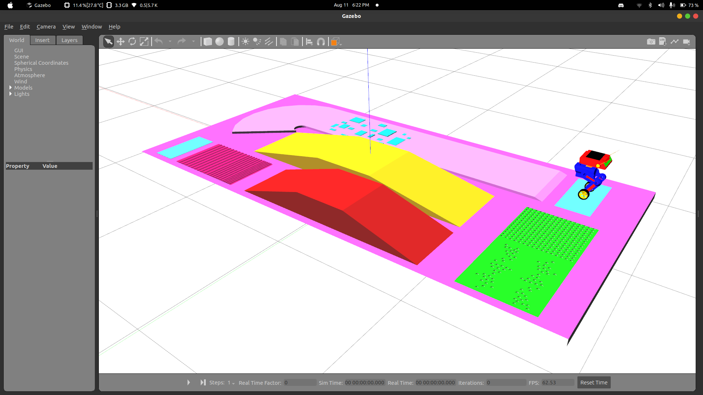

# BD1 Self Balancer

<p align = "justify">
This package contains the code for balancing the bot. The BD1 bot is balanced using the PID Controller.</p>

To check on-point balancing, Run the following commands

    ros2 launch bd1_bot_description gazebo.launch.py
    ros2 run bd1_self_balancer_self_balancer

As a challenge complete the following

- [ ] Do Go-to-Goal Navigation
- [ ] Design keyboard controller and do navigation using that.
- [ ] Use the following commands and complete the course

    ```
    ros2 launch bd1_self_balancer arena.launch.py
    ros2 run bd1_self_balancer self_balancer
    ```

> *__**Note:**__ For every small change in code, the colcon package should be re-build `colcon build `.*

<div style="text" align="center">
    
</div>


### All the best !