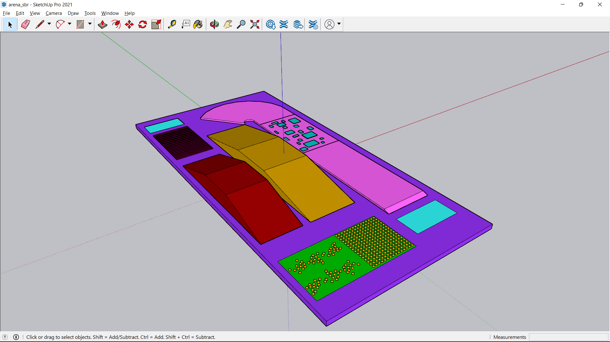
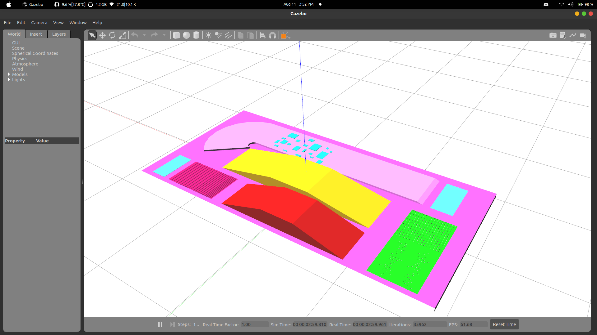

# Simulation World

## Create an Environment

In this project, an arena is created to test the self-balancing bot using the SketchUp software. You can use other 3D designing software like blender. The arena designed in the SketchUp software is shown in the image.

    

The 3D design is converted to a COLLADA file (.dae), so that it can be used in the Gazebo simulation.

To use this COLLADA file, two files are created namely model.sdf and model.config in the models/arena folder.

* model.sdf - simulation description format file is used to define the COLLADA model that is to be used in the simulation.

* model.config - it defines the model.sdf with the descriptions.

A world file is also created to configure the environment on the gazebo. This world file will be handy for the users having many models in the design, need to setup custom lightning patterns and vary the atmosphere. Refer to the files used in this project to get a better idea.

## Test the Simulation Package

Run the command and the gazebo should launch with the arena.

    ros2 launch sim_world world.launch.py

    

